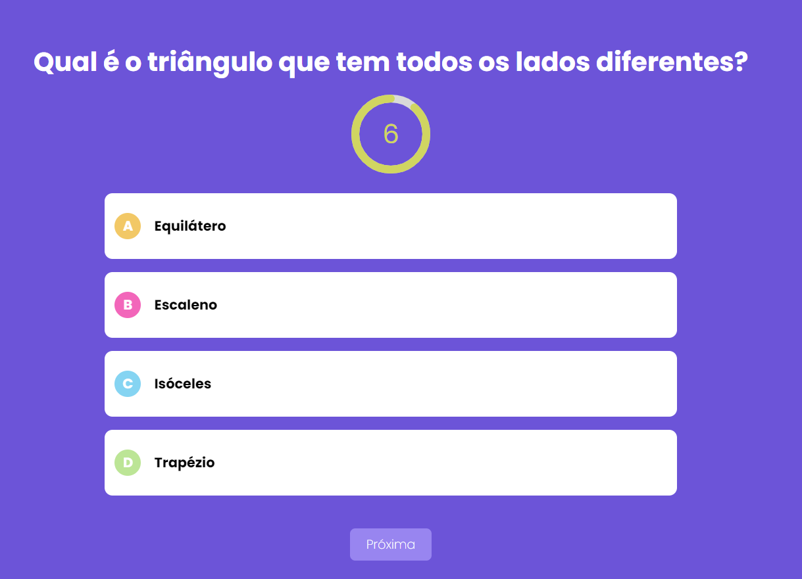
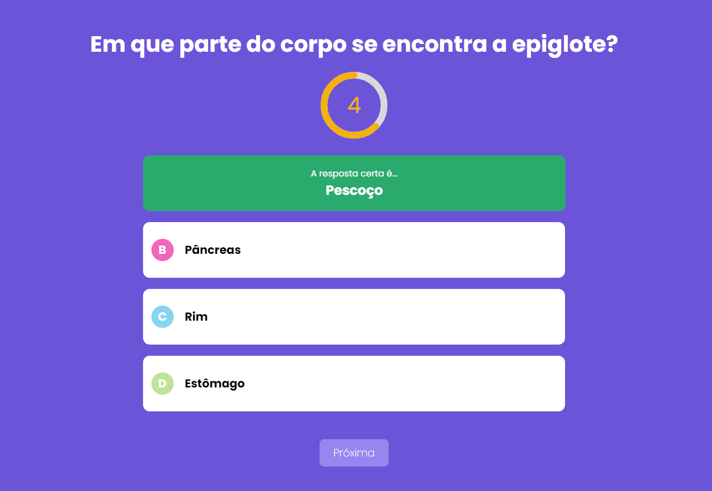
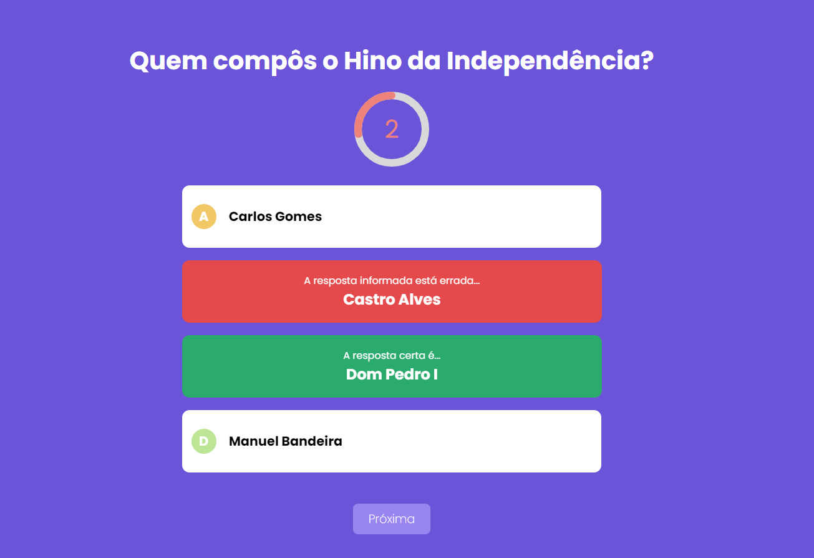
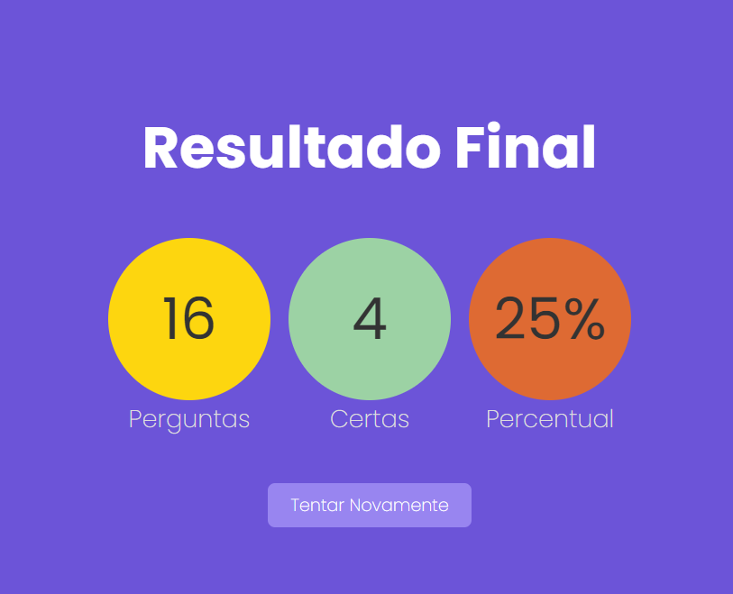

  

Jogo Show do milhão desenvolvido em **Nextjs** com **TypeScript** inteiramente componentizado com **componentes puros**.

  
Curso Udemy - Next.js e React: Projeto Quiz - Full Stack Next JS

  
Instrutor - Leonardo Moura Leitao

  

### Layout do projeto

Tela Principal -  Início do Jogo.
O jogador tem 6s para responder cada pergunta. Se não responder a tempo o jogo passa para a próxima pergunta.

  

Ao clicar na pergunta errado o jogo mostra em verde a resposta correta e a que foi clicado errado.

  

Ao clicar na pergunta errado o jogo mostra em verde a resposta correta e a que foi cliclado errado.

  

No final do jogo e demostrado um percentual de acertos e total de perguntas feitas.

  

  <small>Sandro - 2022</small>

